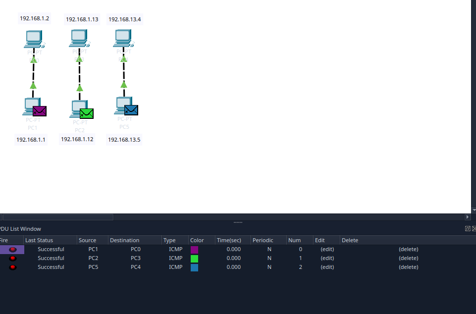
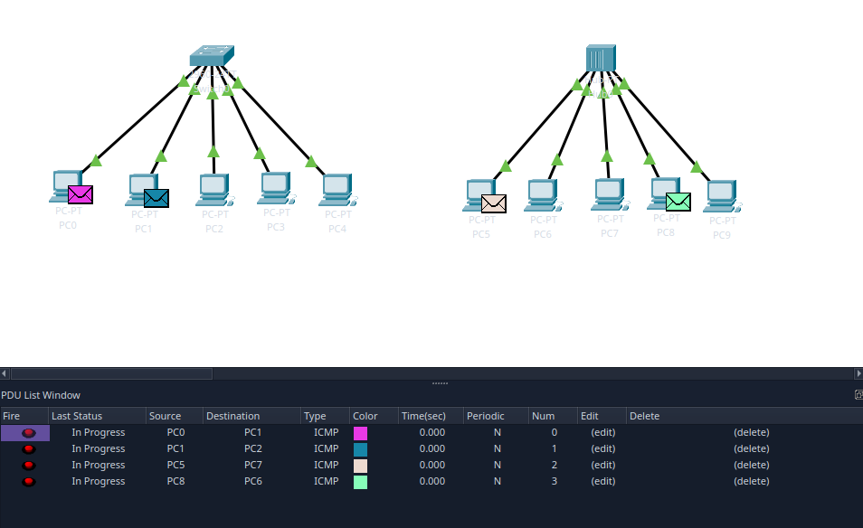
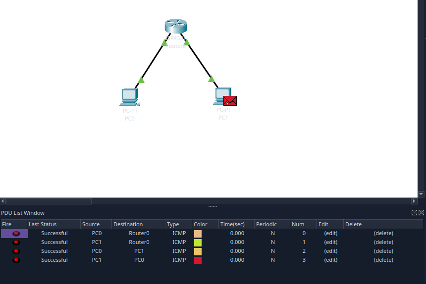
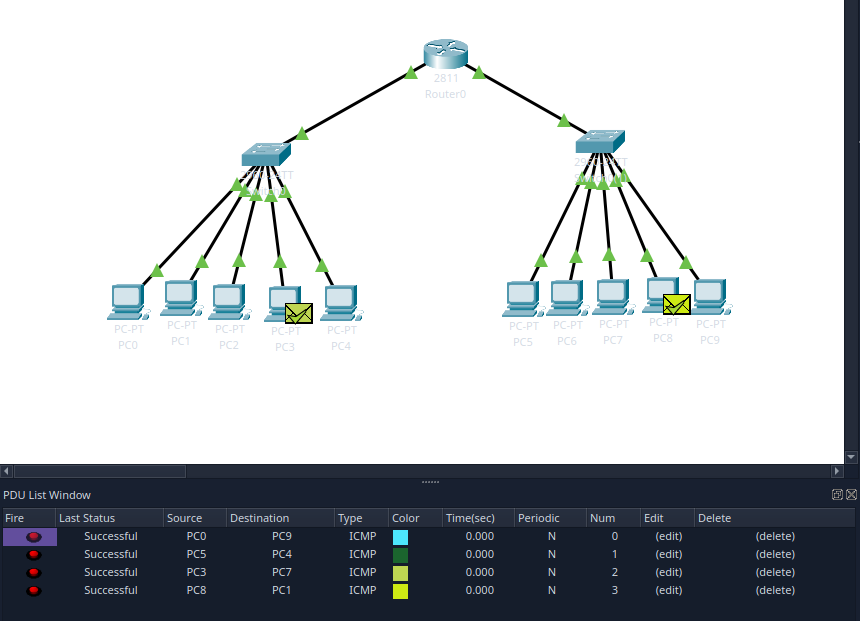
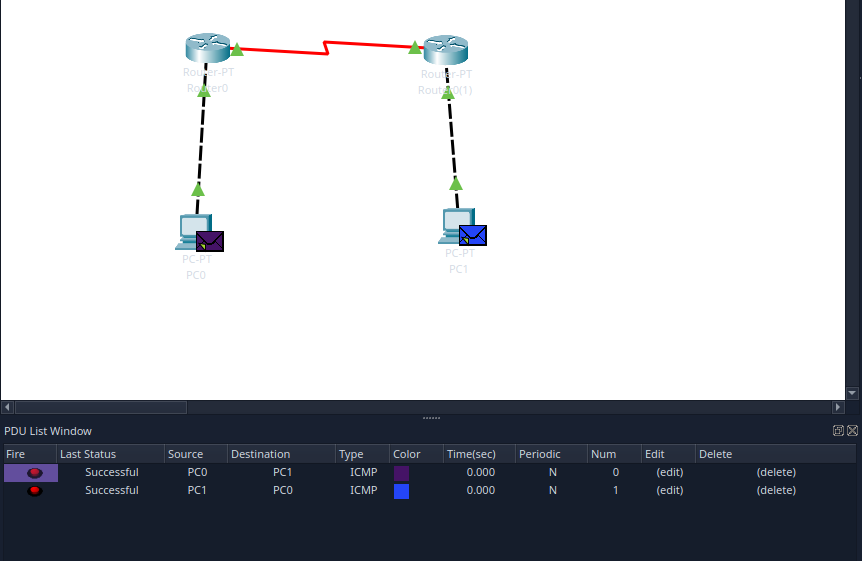
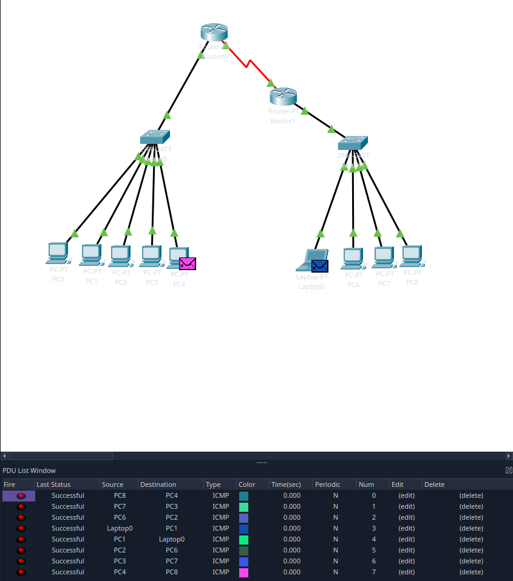
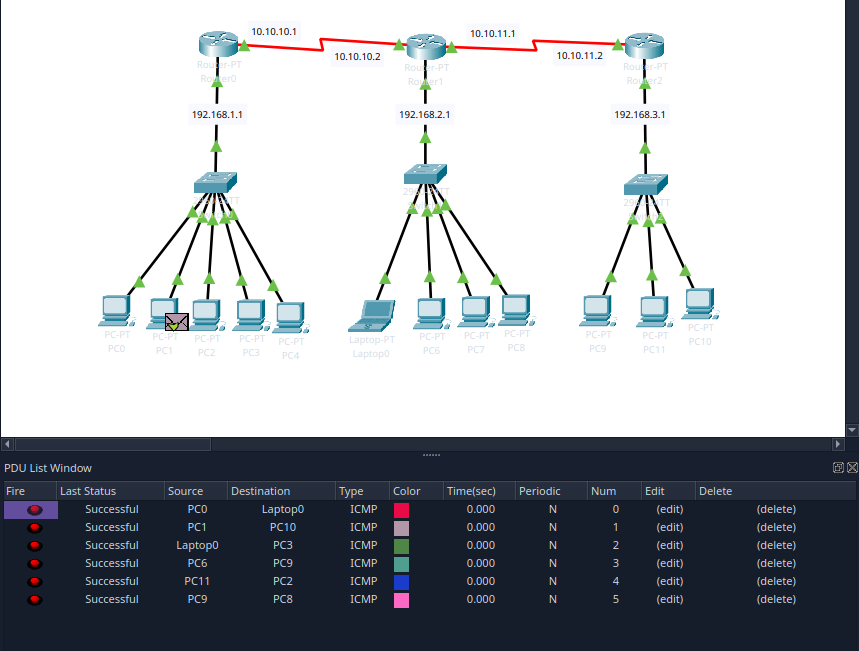

# Deep-In-Net

I've added pictures and questions to all the answers in the audit page to this readme file. To check the configs for ever exercise you need to download and install Cisco Packet Tracer

If you don't have Cisco Packet Tracer, you could have to make an user and then you can download it from https://www.netacad.com/cisco-packet-tracer

## exercise 1

RJ-45 is type of ethernet cable. Comes in two versions: Straight-Through and Crossover.

Straight-Through: Pinout on the both ends is the same. Meaning that wires are arranged in the same order.
Used on the different types on devices, for example between PC-Switch, Switch-Router, Router-Server.

Crossover Cable: Pinout on the one end differs from the other end.
Used on the same types of devices, for example: PC-PC, Switch-Switch, Router-Router. 
Ground part(brown and white/brown wires) are typically on the same parts.
Receive and transmit parts cross over usually, for example pin 1 and 2 are switched to 3 and 6.
It's like that so devices can communicate with other without switch and one PC transmit pins(1 and 2) are connected to another PC receive pins(3 and 6)

Ip address has two key components. First is the Network part, it identifies the entire network(like the street you live on).
Second is the Host part, it identifies the individual device(like the specific house number).

For example if your ip is 192.168.1.5 the first three numbers(192.168.1) represent the network(whole street) and the last number (5) represents the individual device(your house)

Network address for this current IP is 192.168.1.0
Broadcasting address for that network is 192.168.1.255. This is used to send data to all devices in that network.
So 8bits(256)-2 IP-s for the network and broadcast, there is 254 usable ip-s for devices.

## exercise 2

Switch: 

Operates by receiving data and forwarding them to the specific device or mac address. This is done using a MAC address table that switch builds by learning MAC addresses of the devices connected to its ports. It can create separate collision domains for each connected device, which reduce data collisions and improve overall network performance.

Operates on OSI Layer 2 but some switches can also operate on Layer 3 if they have routing capabilities.

Hub: Basic networking device that connects multiple devices and making them act as a single network segment. When it receives data packet, it broadcasts the packet to all connected devices, regardless of the intended recipient. It provides simple way to connect multiple devices in a LAN but they do not manage traffic. All devices use the same collision domain, which can lead to data collisions. 

Operates on Osi Layer 1, deals with physical connections and transmission of raw bit streams.

I would suggest you to not use hub, it's outdated and can cause problems.

## exercise 3

Screen recording as gif.

Shows that http is disabled, instead of simple Hello, i added my own static website to the index.html.
Shows logging in into the ftp server.

https://imgur.com/a/AoACis1

Server is computer or software that provides services, data or programs to other computers. It's purpose is to handle requests from clients and manage network resources.

DHCP automatically assigns iIP addresses and network parameters to devices on the network.
When device connects to a network it sends a request for an IP address. DHCP server then responds by providing available IP address from a predefined pool, allowing device to communicate on the network without manual configuration.

DNS translates human-readable domain names (like kood.tech) into IP addresses that computers use to identify each other on the network.
Enables users to access websites using domain names instead of numerical IP addresses.

HTTP (HyperText Transfer Protocol) is managing how clients(for example web browsers) communicate with servers to request and transmit web resources, as HTML pages, images and other multimedia content. In HTTP transaction typically a web web browser sends a request to a server and it processes this request and returns a response containing a requested resource or an error message if request is not valid.

HTTP transmits data in plain text and therefore data can be intercepted during transmissions. 

HTTPS secure version of HTTP. Security layer uses SSL/TLS to encrypt communication between server and the client. 

FTP (File Transfer Protocol) is used to transfer files between the client and server on the network. It operates using client-server model where the client can RWDNL(Read, Write, Delete, reName, List).

TCP (transmission Control Protocol) establishes connection between client and server before transmitting data, ensures that data is delivered and in the correct order. If packets are lost TCP handles retransmission and reordering.

UDP (User Datagram Protocol) does not establish connection before sending the data, it does not guarantee that packets arrive in order and does not ensure that they arrive at all. No error checking or retransmission.

Video streaming for example uses UDP. When you watch a video and packet gets lost player could just skip to the next part. Thats why media players use buffering to maintain playback without interruption. Online gaming as well, that's why the lag and glitches could occur.

TCP and UDP Operate on OSI layer 4

Port is identifier after the IP address and is used to differentiate different services running on the same server/device. Each port number corresponds to the specific service or application, allowing data to be directed to the appropriate process.

HTTP(80), HTTPS(443) and FTP(21) are using Layer 7. TCP and UDP are using Layer 4

Types of DNS records

A(Address record): Maps domain name to an IP
CNAME(Canonical Name Record): Redirects one domain name to another(works as alias)
MX(Mail Exchange Record): Specifies mail servers on domain
NS(Name Server Record): Indicates the DNS servers for a domain
PRT(Pointer record): Maps an IP address to a domain name(reverse lookup)
TXT(TExt record): Holds text, often for verification

# exercise 4 

Router main roll is to connect multiple networks and direct data base on IP addresses. It analyzes destination IP address of incoming packets and determine the most efficient path for them to reach their destination.

Routers manage traffic between multiple network and can provide functionalities like DHCP, NAT and firewall. Operates at the OSI Layer 3.
Switches connect devices within a single network and uses MAC addresses to forward data to specific devices. Operates at the OSI Layer 2.

Default Getaway is a node(usually a router) that serves as an access point for devices on a local network to communicate with devices on other networks. If a device wants send data to an IP address which is outside its local subnet, it forwards the traffic to the default getaway which then determines how to route the data to its final destination.

# exercise 5

# exercise 6

Routing table is a data structure used by routers to determine the best path for forwarding packets to their destination networks. It contains a list of routes to various network destinations and is necessary for efficient data delivery.

Structure of Routing Table

Destination Network: The IP address of the network to reach (192.168.1.0)
Subnet Mask: Indicates the range of IP addresses in the network (255.255.255.0)
Next Hop: The ip address of the next router to which the packet should be send (10.10.10.1)
Interface: The local interface on the router used to send the packet (eth0)
Metric: A value that indicates the cost of the route; lower values typically indicate preferred routes.

# exercise 7

# exercise 8

